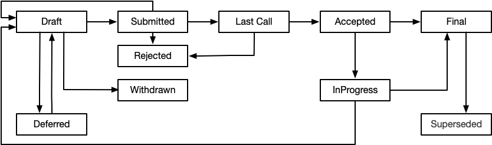

## 什么是ELIP？

ELIP是Elastos Improvement Proposal（亦来云改进提案）的缩写。

ELIP是一种设计文档，它用于向亦来云社区提供信息、描述流程、介绍新特性或者环境等。同时，ELIP应该提供目标特性的简明技术规范和基本原理。

我们希望ELIP成为改进亦来云技术的主要机制，每一个有效的ELIP都应该得到社区大多数人的认可，所以ELIP将由亦来云社区共识CRC维护，ELIP作者有责任听取社区意见修订和维护ELIP。

## 范围

亦来云致力于建设区块链驱动的智能万维网，其基础设施包括：

- 区块链（Blockchain）
- 钱包（Wallet）
- 网络服务（Network Service）
- 存储服务（Storeage Service）
- 应用及运行时（Application and Runtime）

因此，ELIP所涉及的技术范围可以是这五项中的任意一项或多项，如果需要提出针对其他技术领域的提案，应该先对本提案进行更新，扩充亦来云基础设施涉及的技术领域。

## 类型

- **标准跟踪/Standard Track ELIP**

  描述亦来云基础设施设计和实现方面的改变，该改变引起全局性的影响，例如区块链共识的修改、网络协议的修改、服务接口的修改等。一般而言，修改或者建议是否提交ELIP，可以采用以下标准进行衡量：如果修改或者建议只针对单一应用的需求，那么不应该提交ELIP；如果修改或者建议涉及到平台通用行为或者标准，建议或强制平台及所有应用都支持，那么应该提交ELIP。

  标准跟踪ELIP分为设计和实现两个部分，设计部分应提供基本的技术规范和基本原理以及在实现上的指引，实现部分是对该ELIP实现状态的跟踪。
  
- **流程/Process ELIP**

  描述亦来云相关的流程定义或者对流程的改变，流程ELIP类似于标准ELIP，但适用于亦来云平台技术以外的领域。ELIP中也可能提出实施方案，但不应涉及亦来云平台代码库的变更。

  一般而言，流程类ELIP需要得到社区的共识。与信息类ELIP不同，流程类ELIP不仅仅只是建议，用户通常也不能随意忽略它们。比如：包含规程、指南、决策过程的变化以及对亦来云开发中使用的工具或环境的更改。ELIP-1（本提案）即属于流程ELIP。
  
- **信息/Informational ELIP**

  描述亦来云的设计问题，或者向亦来云社区提供一般性的指南或信息，但没有提出新的功能。信息ELIP不一定代表亦来云社区的共识或者建议，因此用户和实施者可以自由选择遵循或者忽视。

强烈建议单个ELIP只包含单个关键建议或者新想法，ELIP的内容越聚焦，就越可能成功。ELIP必须清楚且完整地描述提案，如果提案涉及改进和完善，则需要明确描述改进点。如果提案包含适用的建议实现，建议的实现必须可靠且不能过于复杂。

## 状态及工作流程

ELIP工作流程从一个关于亦来云新的想法开始。每个潜在的ELIP都必须有一个作者，作者可以在他认为合适的论坛或邮件列表中发起讨论，并尝试围绕这个想法建立社区共识。作者应该首先尝试确定这个想法是否可行并且适合ELIP提案，比如先发布到CR（Cyber Republic）网站的论坛是一个不错的方式。

在撰写ELIP之前，公开审查你的想法可以节约潜在的参与者和广泛的社区成员的时间。首先向亦来云社区询问某个创意是否具有独创性，有助于防止在已经被讨论过且被拒绝的内容上花费过多时间（搜索互联网并不总是能做到这一点），确保这个想法适用于整个社区，而不仅仅适用于作者。一个作者听起来不错的想法，但并不意味着对亦来云社区中的大多数人都有效。小的增强或补丁通常不需要在多个项目之间进行标准化，而应该向适用的亦来云问题跟踪(Issues)提交补丁或者注入相关的亦来云开发流程。

作者一旦确认了提议有可能被接受，就应该向CR网站提交一份ELIP草案。该草案必须以下文中指定的ELIP方式编写，否则将因为不遵守ELIP的正确格式而被驳回。强烈建议单个ELIP包含单个关键提案或新想法。ELIP的内容越聚焦，就越有可能成功。如果有疑问，请将ELIP拆分为几个重点明确的ELIP。

ELIP在处理流程中可能的状态和路径如下图所示：



提交到CR网站的ELIP由CRC秘书处进行初步审查，如果提案太不聚焦或者过于宽泛就有可能被拒绝。ELIP无法由作者自行编号，而是在通过审查才会被赋于一个未使用的编号，并参考作者建议被归类到标准ELIP、流程ELIP或者信息ELIP三者之一，最后以"Draft"状态公开发布到CR网站上。

CRC秘书处不会无理拒绝ELIP。拒绝ELIP的原因可能包括无视格式规则、重复建议、太不聚焦或太宽泛、技术不健全、没有提供适当的动机或解决向后兼容性，或不符合亦来云理念。ELIP要被接受必须满足某些最低标准。

草案的编辑权只对作者开放，ELIP作者可以根据需要在网站上更新草案。社区的其他人可以在草案下方留言讨论草案内容。

一旦作者认为草案已经足够成熟不再需要修改，并且准备好了接受CRC的投票，可以正式提交"Draft"状态的ELIP，ELIP状态变更为"Submitted"，此时ELIP处于不可编辑的状态并准备好接受CRC的投票。CRC秘书处应及时处理“Submitted”状态的ELIP，以初审的标准再次复审ELIP，未通过审核的ELIP将被还原为“Draft”状态并通知作者，告知作者原因。

通过审查的ELIP正式提案给CRC投票表决，秘书处的这个处理过程最长不超过一周。在这个过程中，作者可以出于任何原因撤回该草案，作者撤回后ELIP的状态变更为"Withdrawn"。一旦ELIP进入"Submitted"状态，后续的处理流程和CRC提案的流程一致。

CRC应在一周内完成对正式提案的ELIP的投票，并将投票通过的ELIP置为"Last Call"状态，这意味着此ELIP处于公示期，未通过的ELIP被置为"Rejected"。如果一周内CRC未完成表决（参与投票的人数不足），则ELIP被置为"Rejected"状态。

ELIP的公示期为一周，一周内的反对票数未达到总流通量的10%即为通过，ELIP的状态将被置为“Accepted"，表示该ELIP被正式接受。一周内的反对票超过10%，ELIP的状态则被置为”Rejected"。

ELIP的公示期为一周，一周内的反对票数未达到总流通量的10%即为通过，ELIP的状态将被置为“Accepted"，表示该ELIP被正式接受。一周内的反对票超过10%，ELIP的状态则被置为”Rejected"。

一旦接受了ELIP，就必须完成参考实现，这期间ELIP的状态是"InProgress"。当参考实现完成并达到完成标准，状态将更改为“Final”。在完成参考实现的过程中，如果作者发现ELIP提案存在缺陷需要修正，那么可以更新ELIP，ELIP在修正后自动变更为"Draft"状态，需要重新得到CRC共识。

ELIP的状态也可以是“Deferred”。当ELIP没有任何进展时，ELIP作者或CRC秘书处可以将ELIP的状态置为“Deferred”。针对被延迟的ELIP，CRC秘书处可以按需将其重新置为“Draft”状态。

ELIP也可以被“Rejected”，也就是说，这不是个好提议，记录下这一事实可以做为其他人的参考依据，所以仍然很重要。

ELIP也可以被一个不同的ELIP取代，使原来的ELIP过时。这是为了提供信息类的ELIP，如API的版本2可以替换版本1。被替代的ELIP的状态更新为“Superseded”。

ELIP处理的流程图如下：


## 内容要素

一个成功的ELIP应该具备以下要素：

- **前导** - RFC822样式的头部，描述关于ELIP的元数据，包括ELIP编号、简短的描述性标题以及每个作者及其联系信息等。
- **摘要** - 对正在解决的技术问题的简短描述（200字内）。
- **规范** - 技术规范应该描述新特性相关的语法和语义。规范应足够详细，以允许任何亦来云兼容平台的竞争以及实现互操作。
- **动机** - 对于想要更改亦来云技术基础设施或者社区流程的ELIP来说，动机至关重要。它应该清楚地解释为什么现有的协议规范或者流程不足以解决ELIP提出并解决的问题。没有清晰和充足动机的ELIP可能会被直接拒绝。
- **基本原理** - 基本原理通过描述设计动因，以及为什么做出特定的设计来充实规范。它还应该描述替代设计和相关工作，例如，如何在其他语言中支持该特性。这里还应该探讨一下在ELIP讨论期间提出的重要反对意见或担忧。
- **向后兼容性** - 所有引入向后不兼容的ELIP必须包括一个描述这些不兼容及其严重性的部分。ELIP必须解释作者如何处理这些不兼容性。如果提交的ELIP没有足够的向后兼容性处理，可能会被拒绝。
- **参考实现** - 参考实现必须在任何ELIP处于“Final”状态之前完成，但在"Accepted"ELIP之前不需要完成。最好先完成规范和基本原理，制定好参考实现的完成标准，并在编写代码之前达成共识。最终实现必须包括适用于亦来云的测试代码和文档。
- **版权/公共域** - 每个ELIP必须明确地标记为放置在公共域中（请参阅本ELIP示例），或者根据开放出版物许可证进行许可。如果ELIP作者没有声明许可，默认为MIT许可。

## 格式和模板

ELIP应该为markdown格式，并且章节的标题最高可以使用二级标题（一级标题保留用于ELIP的自动格式化）。

### 前导信息

每个ELIP必须以一个RFC822风格的前导头开始。标题必须按以下顺序显示。除了标有“*”的标题是可选的，所有其他元素都是必需的，格式如下所述：

```
  ELIP: <ELIP number>
  Title: <ELIP title>  
  Author: <list of authors' nick names and optionally, did, email addrs>
* Discussions-To: <email address or url>
  Status: <Draft | Submitted | Last Call | Accepted | Deferred |
          Rejected | Withdrawn | InProgress | Final | Superseded>
  Type: <Standards Track | Process | Informational>
  Created: <date created on, in ISO 8601 (yyyy-mm-dd) format>
* Post-History: <dates of postings to CR>
* Requires: <list of ELIP number>
* Replaces: <ELIP number>
* Superseded-By: <ELIP number>
* Resolution: <url>
```

前导元素的说明如下：

- **ELIP**

  作者提交CRC秘书处的ELIP被接受后，由秘书处分配统一编号。在这之前，作者可以保持ELIP编号的值为空白。

- **Title**

  ELIP的标题，要求简洁概要。

- **Author**

  Author标题列出了ELIP的所有作者/所有者的昵称和可选的DID、电子邮件地址。作者栏的格式为：

  > Nickname DID [<address@dom.ain>](address@dom.ain)
  >
  
  其中的did和邮件地址可选，如果没有给出DID和邮件地址，则仅提供昵称即可。
  
  如果有多个作者，按照RFC2822对续行的约定，每个作者都应该在单独的一行上。

- **Discussions-To**
  
  当一个ELIP处于讨论中时（通常是在最初的草稿阶段），Discussions-To将指示正在讨论ELIP的邮件列表或URL。如果只是私下讨论，则无需讨论标题。
  
- **Status**
  
  ELIP当前所在的状态，为ELIP状态之一。
  
- **Type**
  
  Type栏指示ELIP的类型：标准跟踪、流程或者信息。
  
- **Created**
  
  Created记录ELIP被分配号码的日期。日期书写采用yyyy-mm-dd格式，例如`2017-08-01`。
  
- **Post-History**
  
  Post-History用于记录新版本发送到CR网站的日期。如果ELIP有多次更新，那么该值是一个逗号分隔的日期列表。日期书写采用yyyy-mm-dd格式，例如`2017-08-01`。如果日期列表过长，可以按照RFC2822对续行的约定进行续行。
  
- **Requires**
  
  如果ELIP依赖于其它ELIP，则应该有一个Requires栏，指示ELIP所依赖的其它ELIPs编号。
  
- **Replaces**
  
  如果ELIP取代并废弃一个旧的ELIP，那么必须有一个Replace头，其中包含被它废弃的ELIP的编号。
  
- **Superseded-By**
  
  ELIP也可能有一个Superseded的头，指示ELIP已被较新的ELIP废弃；该值是替换当前文档的ELIP的编号。
  
- **Resolution**
  
  Resolution标题仅适用于标准跟踪ELIP。它包含一个URL，该URL应该指向一个电子邮件消息或其他Web资源，在那里发布关于ELIP的声明。

原则上前导信息应该由网站在作者填入必要信息后自动生成，不属于ELIP正文。ELIP在上链时，仅对ELIP正文进行处理，不包含这部分前导信息。

## 辅助文件

ELIP可以包括辅助文件，如图表、图像文件等。辅助文件应该包含在该ELIP同名的子目录中。辅助文件必须命名为ELIP-XXXX-Y.ext，其中“XXXX”是ELIP编号，“Y”是序列号（从1开始），“ext”是实际的文件扩展名（例如“png”）。

## 所有权及奖励

有时需要将ELIP的所有权转让给新的维护者。一般而言，我们希望保留原作者作为转让的ELIP的共同作者，但这取决于原作者。转让所有权的一个可能的理由是，原始作者不再有时间或兴趣更新或跟进ELIP进程，或已经消失了很长时间（无法通过邮件等常规方法联系到）。转让所有权的一个不好的原因是你不同意ELIP的方向。我们试图围绕一个ELIP达成共识，但如果不能达成共识，你可以提交一个竞争性的ELIP。

如果您对ELIP的所有权感兴趣，可以发送一条请求接管的消息，该消息同时发送给原始作者和CRC秘书处。如果原作者没有及时回复消息，CRC秘书处会单方面做出决定。

CR为每个ELIP设定了一定的奖励额度，根据ELIP的工作量和价值，额度可以在20ELA～100ELA之间，由ELIP的作者在提交ELIP时一同提交给秘书处，具体的额度也同ELIP本身一样经过CRC共识。一个ELIP也可能因为奖励额度设置不合理被拒绝。在ELIP共识通过进入"Accept"状态后，将发放50%的奖励；当ELIP完成并进入"Final"状态后发放剩余50%。

如果在ELIP处理过程中发生了所有权转移，那么在转移发生时间之后的奖励额度将发放给ELIP新的维护者。

## CRC秘书处ELIP相关的职责和工作流程

在ELIP作者发起ELIP过程中，需要和CRC秘书处进行交互，由CRC秘书处协助作者共同完成ELIP发起的初始流程。

CRC秘书处需要对ELIP作者提交到CR的所有ELIP进行以下的处理：

- 阅读ELIP以检查它是否准备就绪：内容完整，想法必须具有技术可行性，即使它们有可能不被接受。
- 标题应准确描述内容。
- 从语言和语法角度修订ELIP（拼写，语法，句子结构等），规范代码样式（如有规范应该参考规范定义的样式）。

如果ELIP没有准备好，秘书处应将其发回给作者进行修改，并附上具体说明。

如果CRC秘书处审阅后认为ELIP上述要素都具备，那么将进行如下处理：

- 分配一个ELIP编号。
- 将ELIP的状态变更为"Draft"，并在CR网站公布该ELIP草稿供社区参与和讨论（这个期间作者可以继续修订到他认为可以正式提交）。

在作者正式提交ELIP后，秘书处需要进行如下处理：

- 将该ELIP提请到CRC审议并投票，秘书处的这个处理过程最长不超过一周。

ELIP如果是标准跟踪类型并包含参考实现，那么在ELIP社区公示通过并进入"Accepted"状态后，秘书处需要进行如下处理：

- ELIP作者提出完成请求后，应该根据ELIP中描述完成标准作为参照，检查ELIP是否完成。

如果已达到完成条件，那么将ELIP置为"Final"状态；否则驳回作者的完成请求，并附上说明。

## 历史

该文件源自[Amir Taaki](genjix@riseup.net)编写的[比特币BIP-0001](https://github.com/bitcoin/bips)，后者又源自[Python PEP-0001](https://www.python.org/dev/peps/)。 在许多地方，文本只是被复制和修改。 虽然PEP-0001文本是由Barry Warsaw，Jeremy Hylton和David Goodger编写的，但他们不对其在ELIP中的使用负责，也不应该对ELIP特有的技术问题感到困扰。 如有意见和建议请直接发送给亦来云CRC秘书处。

## 版权

本ELIP采用MIT许可，版权和相关权通过MIT许可进行免除。
