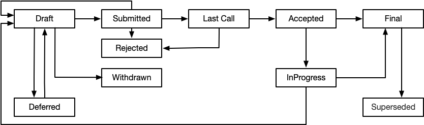
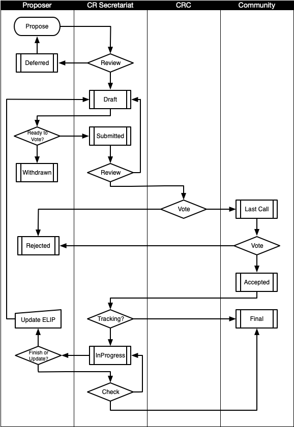

## What is ELIP?

ELIP is an acronym for Elastos Improvement Proposal.

ELIP is a design document that provides information, describes processes, introduces new features, or the environment to the Elastos Community. At the same time, ELIP should provide concise technical specifications and a rationale for the target characteristics.

We hope that ELIP will become the main mechanism for improving Elastos technology. Every effective ELIP should be accepted by the majority in the community. Therefore, ELIP will be managed by Cyber Republic Consensus CRC. ELIP authors have a responsibility to consider community comments to revise and maintain ELIP .

## Scope

Elastos is committed to building a Smart Web Powered by Blockchain. Its infrastructure includes:

- Blockchain
- Wallet
- Network Service
- Storeage Service
- Application and Runtime

Therefore, the technical scope of ELIP can be one or more of these five categories. If proposals for other technical fields need to be proposed, this proposal should be updated and expanded to include the technical fields involved in Elastos infrastructure.

## Types

- **Standard Track ELIP**

  The description also relates to changes in the design and implementation of Elastos infrastructure, which have a global impact, such as the modification of blockchain consensus, the modification of network protocols, and the modification of service interfaces.
  In general, whether a modification or suggestion is to be submitted as an ELIP can be measured by the following criteria:   If the modification or recommendation is only for a single application, it shouldn’t be raised as an ELIP;   if the modification or recommendation involves a platform common behavior or standard, it recommnets or mandates the platform and all applications to support, then it should be submitted as an ELIP.
  The standards tracking ELIP is divided into two parts: design and implementation. The design part should provide basic technical specifications and basic principles as well as implementation guidance. The implementation part is to track the status of the ELIP implementation.
  
- **Process ELIP**

  Describes a process surrounding Elastos, or proposes a change to a process. The process ELIP is similar to the Standards ELIP, but it is applicable to areas other than Elastos platform technology. Implementations may also be proposed in the ELIP, but should not involve changes to the Elastos platform codebase.
  In general, the Process ELIP needs to get community consensus. Unlike the information ELIP, the Process ELIP is more than recommendation, and users are typically not free to ignore them. Examples include procedures, guidelines, changes to the decision-making process, and changes to the tools or environments used in Elastos development. ELIP-1 (this proposal) belongs to the process ELIP.
  
- **Informational ELIP**

  Describe the design issues of the Elastos, or provide general guidelines or information to the Elastos community, but does not propose new features. The informational ELIP does not necessarily represent the consensus or recommendation of the Elastos community, so users and implementers are free to ignore Informational ELIP or follow their advice.

It is strongly recommended that a single ELIP contain only a single key recommendation or new idea, and the more focused the ELIP content is, the more likely it is to succeed. The ELIP must describe the proposal clearly and completely, and if the proposal involves improvements, it needs to clearly describe the improvement points. If the proposal contains an applicable implementation of the recommendation, the proposed implementation must be reliable and not overly complex.

## Status and workflow

The ELIP process begins with a new idea for Elastos. Each potential ELIP must have an initiator who can initiate a discussion in the forum or mailing list he deems appropriate and try to build a community consensus around the idea. The initiator (a.k.a. author) should first try to determine if the idea is feasible and suitable for ELIP proposals. Posting it to the CR (Cyber ​​Republic) website is a good way.

Vetting an idea publicly before going as far as writing an ELIP is meant to save both the potential author and the wider community. Many ideas have been brought forward for changing Elastos that have been rejected for various reasons. Asking the Elastos community first if an idea is original helps prevent too much time being spent on something that is guaranteed to be rejected based on prior discussions (searching the internet does not always do the trick). It also helps to make sure the idea is applicable to the entire community and not just the author. Just because an idea sounds good to the author does not mean it will work for most people in most areas where Elastos is used. Small enhancements or patches often don't need standardisation between multiple projects; these don't need an ELIP and should be injected into the relevant Elastos development workflow with a patch submission to the applicable Bitcoin issue tracker.

Once the sponsor has confirmed that the proposal is likely to be accepted, a copy of the ELIP should be submitted to the CR website. The draft must be written in the ELIP format specified below, otherwise it will be rejected because it does not comply with the correct format of ELIP. It is highly recommended that a single ELIP contain a single key proposal or new idea. The more focused the content of ELIP is, the more likely it is to succeed. If in doubt, split the ELIP into several well-defined ELIPs.

The possible states and paths of the ELIP in the process flow are shown in the following figure:



The ELIP submitted to the CR website is subject to a preliminary review by CRC Secretariat and may be rejected if the proposal is too unfocused or too broad. The ELIP cannot be numbered by the author himself, but will be assigned an unused number after review. It will be classified into one of the standard ELIP, the process ELIP or the information ELIP with reference to the author's suggestion, and finally published in CR website in a DRAFT status.

The CRC Secretariat shouldn’t reject the ELIP without a reason.  Possible reasons for refusing ELIP may include incorrect formatting rules, repeating suggestions, being too unfocused or too broad, not technically sound, failing to provide appropriate motivation or addressing backward compatibility, or not complying with the Elastos concept. ELIP needs to meet certain minimum standards to be accepted.

The editorial rights of the draft are only open to authors, and ELIP authors can update the draft on the website as needed. Other community members can leave a comment below the draft to discuss.

Once the author believes that the draft is mature enough and no further modification needed, the draft ELIP is ready for CRC voting. The author can formally submit the ELIP and the ELIP status changes to "Submitted". At this point, the ELIP is in an uneditable state and is ready.  The CRC Secretariat shall process the ELIP of the "Submitted" status and review the ELIP again with the criteria of the preliminary review. The ELIP that doesn’t pass the review will be set back to the “Draft” status and the author is notified the reason.

The CRC should complete the vote for the ELIP of the formal proposal within one week and set the ELIP for voting to the "Last Call" status, which means that the ELIP is in the publicity period and the unsuccessful ELIP is set to "Rejected". If the CRC does not complete the vote within one week (the number of people participating in the vote is insufficient), the ELIP is placed in the "Rejected" state.

The publicity period of ELIP is one week. If the number of negative votes in a week does not reach 10% of the total liquidity, the status of ELIP will be set to "Accepted", indicating that the ELIP is officially accepted. Otherwise, the status of ELIP is set to "Rejected".

The standard tracking ELIP consists of two parts, a design document and a reference implementation. ELIP should be reviewed and accepted before starting the reference implementation, unless the reference implementation will help people understand ELIP. The standard tracking ELIP must include an implementation code, patch or equivalent URL form and meet the completion criteria of the ELIP description - it may be placed in the "Final" state.

Once the ELIP is accepted, the reference implementation must be completed, during which the status of the ELIP is "InProgress". When the reference implementation is complete and the completion criteria are reached, the status changes to "Final". In the process of completing the reference implementation, if the author finds that the ELIP proposal has defects that need to be corrected, then the ELIP can be updated, and the ELIP is automatically changed to the "Draft" state after the correction, and need to go through the CRC consensus process.

The status of the ELIP can also be "Deferred". When there is no progress in ELIP, the ELIP author or CRC Secretariat can set the status of the ELIP to "Deferred". CRC Secretariat can set the "Deferred" ELIP as "Draft" as needed.

ELIP can also be "Rejected", which means that this is not a good idea.  It's important to record this since it can be used as a reference for others.

ELIP can also be replaced by a different ELIP, making the original ELIP obsolete. This is for Informational ELIP. For example, API version 2 can replace API version 1. The status of the replaced ELIP is updated to "Superseded".

The flow chart of ELIP processing is as follows:



## Content element

A proper ELIP should have the following elements:

- **Preamble** - RFC 822 style headers containing meta-data about the ELIP, including the ELIP number, a short descriptive title (limited to a maximum of 44 characters), the names, and optionally the contact info for each author, etc..
- **Abstract** - a short description of the technical issue being addressed (within 200 words).
- **Specifications** -  The technical specification should describe the syntax and semantics of any new feature. The specification should be detailed enough to allow competing, interoperable implementations for any of the current Elastos  platforms.
- **Motivation** - The motivation is critical for ELIP that want to change the Bitcoin protocol. It should clearly explain why the existing protocol specification is inadequate to address the problem that the ELIP solves. ELIP submissions without sufficient motivation may be rejected outright.
- **Fundamentals** - The rationale enriches the specification by describing the design drivers and why specific designs are made. It should also describe alternative designs and related work, such as how to support this feature in other languages.
- **Rationale** - The rationale fleshes out the specification by describing what motivated the design and why particular design decisions were made. It should describe alternate designs that were considered and related work, e.g. how the feature is supported in other languages.It is also worthwhile to discuss important objections or concerns raised during the ELIP discussion.
- **Backward compatibility** -  All ELIPs that introduce backwards incompatibilities must include a section describing these incompatibilities and their severity. The ELIP must explain how the author proposes to deal with these incompatibilities. ELIP submissions without a sufficient backwards compatibility treatise may be rejected outright.
- **Reference Implementation** - The reference implementation must be completed before any ELIP is in the "Final" state, but does not need to be completed before the "Accepted" ELIP. It is best to complete the specification and basic principles, set the completion criteria for the reference implementation, and reach a consensus before writing the code. The final implementation must include test code and documentation for Elastos.
- **Copyright/Public Domain** - Each ELP must either be explicitly labelled as placed in the public domain (see this ELIP as an example) or licensed under the Open Publication License. If the ELIP author does not claim permission, the default is MIT license.

## Format and template

The ELIP should be in markdown format, and the title of the chapter can use up to the second level title (the first level title is reserved for automatic formatting of ELIP).

### ELIP Header Preamble

Each ELIP must start with an RFC822-style leader. The title must be displayed in the following order. Except for the title marked with "*" is optional, all other elements are required, the format is as follows:

```
  ELIP: <ELIP number>
  Title: <ELIP title>  
  Author: <list of authors' nick names and optionally, did, email addrs>
* Discussions-To: <email address or url>
  Status: <Draft | Submitted | Last Call | Accepted | Deferred |
      Rejected | Withdrawn | InProgress | Final | Superseded>
  Type: <Standards Track | Process | Informational>
  Created: <date created on, in ISO 8601 (yyyy-mm-dd) format>
* Post-History: <dates of postings to CR>
* Requires: <list of ELIP number>
* Replaces: <ELIP number>
* Superseded-By: <ELIP number>
* Resolution: <url>
```

The description of the leading elements is as follows:

- **ELIP**

  After ELIP is reviewed and accepted by CRC Secretariat, the Secretariat assigns a unique number. Prior to this, the author can leave the ELIP number blank.

- **Title**

  The title of the ELIP requires a brief summary.

- **Author**

  The Author title lists the nicknames and optional DIDs and email addresses of all ELIP authors/owners. The format of the author column is:

  > Nickname DID [<address@dom.ain>](address@dom.ain)
  >
  
  The did and email addresses are optional. If the DID and email address are not given, only the nickname can be provided.
  If there are multiple authors, each author should be on a separate line, as per RFC2822 for the continuation line.

- **Discussions-To**
  
  When an ELIP is in the discussion (usually in the initial draft stage), Discussions-To will indicate that the ELIP mailing list or URL is being discussed. If you only discuss it privately, you don't need to discuss the title.
  
- **Status**
  
  The current state of the ELIP is one of the ELIP states.
  
- **Type**
  
  The Type column indicates the type of ELIP: standard tracking, process, or information.
  
- **Created**
  
  Created records the date on which the ELIP was assigned a number. The date is written in yyyy-mm-dd format, for example `2017-08-01`.
  
- **Post-History**
  
  Post-History is used to record the date the new version was sent to the CR website. If the ELIP has multiple updates, the value is a comma-separated list of dates. The date is written in yyyy-mm-dd format, for example `2017-08-01`. If the date list is too long, you can follow the continuation convention in accordance with RFC2822.
  
- **Requires**
  
  If ELIP relies on other ELIPs, there should be a Requires column indicating the other ELIPs that ELIP depends on.
  
- **Replaces**
  
  If ELIP replaces and discards an old ELIP, then there must be a Replace header containing the number of the ELIP that was discarded by it.
  
- **Superseded-By**
  
  The ELIP may also have a Superseded header indicating that the ELIP has been discarded by the newer ELIP; this value is the number of the ELIP that replaces the current document.
  
- **Resolution**
  
  The Resolution title applies only to the standard tracking ELIP. It contains a URL that points to an email message or other web resource where the statement about ELIP is posted.

In principle, the preamble information should be automatically generated by the website after the author fills in the necessary information, and is not part of the ELIP body. When ELIP is on the chain, only the ELIP body is processed, and this part of the preamble information is not included.

## Auxiliary file

An ELIP may include auxiliary files such as diagrams. Image files should be included in a subdirectory for that ELIP. Auxiliary files must be named ELIP-XXXX-Y.ext, where "XXXX" is the ELIP number, "Y" is a serial number (starting at 1), and "ext" is replaced by the actual file extension (e.g. "png").

## Ownership and rewards

It occasionally becomes necessary to transfer ownership of ELIPs to a new author. In general, we'd like to retain the original author as a co-author of the transferred ELIP, but that's really up to the original author. A good reason to transfer ownership is because the original author no longer has the time or interest in updating it or following through with the ELIP process, or has fallen off the face of the 'net (i.e. is unreachable or not responding to email). A bad reason to transfer ownership is because you don't agree with the direction of the ELIP. We try to build consensus around a ELIP, but if that's not possible, you can always submit a competing ELIP.

If you are interested in assuming ownership of a ELIP, send a message asking to take over, addressed to both the original author and the CRC Secretariat. If the original author doesn't respond to email in a timely manner, the CRC Secretariat will make a unilateral decision.

CR sets a certain amount of reward for each ELIP. According to the workload and value of ELIP, the amount can be between 20ELA and 100ELA. The author of ELIP submits it to the secretariat when submitting ELIP. The amount is decided through the CRC consensus. An ELIP may also be rejected because the reward quota is set unreasonably. After the ELIP enters the "Accept" state, a 50% bonus will be issued; when the ELIP completes and enters the "Final" state, the remaining 50% will be issued.

If ownership transfer occurs during ELIP processing, the award amount after the transfer occurs will be issued to the new ELIP author.

## CRC Secretariat Responsibilities and Workflow

ELIP authors need to work closely with the CRC Secretariat and the CRC Secretariat will assist the authors in completing the process of initiating ELIP.

For each new ELIP that comes in CRC Secretariat does the following:

- Read the ELIP to check if it is ready: sound and complete. The ideas must make technical sense, even if they don't seem likely to be accepted.
- The title should accurately describe the content.
- Edit the ELIP for language (spelling, grammar, sentence structure, etc.), code style . (if there is a specification, you should refer to the style defined by the specification).

If the ELIP isn't ready, the CRC Secretariat will send it back to the author for revision, with specific instructions.

If the CRC Secretariat reviews and believes that the above elements of the ELIP are in place, the Secretariat will:

- Assign an ELIP number.
- Change the status of ELIP to "Draft" and publish the draft ELIP on the CR website for community participation and discussion (the author can continue to revise until he believes it can be formally submitted).

After the author officially submits the ELIP, the Secretariat will:

- Raise the ELIP for CRC for review and voting. The Secretariat shall complete this within one week.

If the ELIP is a standard tracking type and includes a reference implementation, then after it enters the "Accepted" state, the Secretariat needs to do the following:

- After the ELIP author proposes to complete the ELIP, CRC SSecretariat should check whether the ELIP is completed according to the completion criteria described in the ELIP.

If the completion criteria is met, Secretariat will set the ELIP to "Final" state; otherwise the author's completion request is rejected with instructions.

## History

The file is derived from[bitcoin BIP-0001](https://github.com/bitcoin/bips) by [Amir Taaki](genjix@riseup.net), which in turn is derived from [Python PEP-0001](https://www.python.org/dev/peps/). In many places, text is only copied and modified. Although the PEP-0001 text was written by Barry Warsaw, Jeremy Hylton, and David Goodger, they are not responsible for their use in ELIP and should not be bothered by ELIP-specific technical issues. Please direct your comments or suggestions to CRC Secretariat.

## Copyright

This ELIP is licensed under MIT, and copyright and related rights are waived by MIT license.
